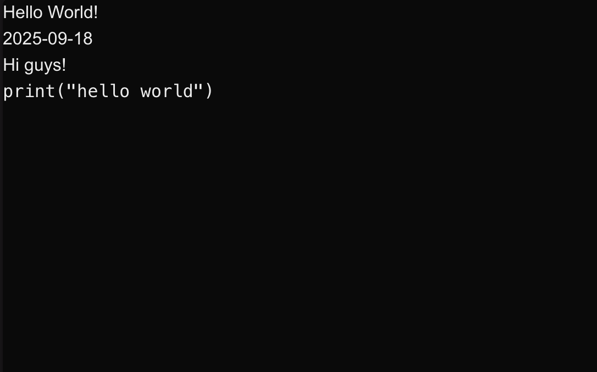

Hi guys!

Welcome to my first blog post. Finally got everything set up. Right now it looks terrible, but I hope by the time you're reading this it looks better.

Using Next.js and MDX to create this site. My folder structure looks something like this:
```
src/
  content/
    2025-09-18-hello-world/
      index.mdx
      blog.png
```
To dynamically get these files, I use the `fs` module in Node.js to read the contents of the `content` directory and generate a list of blog posts.

I'm also leveraging Next.js *slugs* to generate pages for each MDX file.

One major issue I ran into was with the image paths. I want to use relative paths instead of absolute paths--where absolute paths needed to be referenced in the `public/` directory. The issue with the `public/` directory is that I wanted everything to be contained within the directory of the blog itself.

The workaround I found was to use the `<Image/>` tag directly inside the MDX file and import the image file normally like any other `tsx` file.

This is what things currently look like:



By the end of things, I hope it looks better!

How codeblocks look:
```python
print("hello world")
```

How latex looks:
$$
f(x) = mx^x+b
$$
