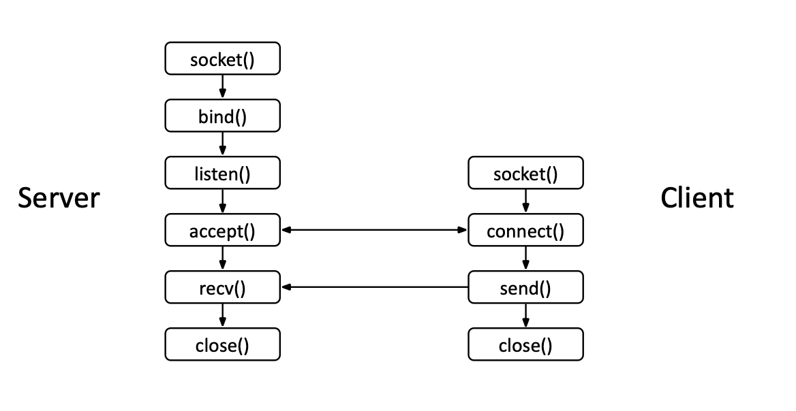

## Prelude

We're going to talk about sockets, socket programming, and creating a mini `iPerf` clone. `iPerf` is essentially a tool to measure throughput on a network.


## What Are Sockets?

If we think about computer networks as interconnected tunnels between devices, sockets can be thought of as the doors to these tunnels.

Traffic (items that go through the tunnels) must follow a set of rules (called protocols). The two main types are *TCP* and *UDP*:

- *TCP* is a reliable protocol that guarantees delivery of data.
- *UDP* is a faster, less reliable protocol that does not guarantee delivery.

Sockets (and any other network communication) are presented as *file descriptors* on Unix-like systems. By getting a file descriptor for a socket, we can interact with that socket.


## Socket Programming in C++

For this tutorial, we'll be creating both the client and the server. The basic architecture for both looks something like this:



Let's walk through the flow. Both client and server must first get a socket. In C++, this is what it looks like:

```cpp
// initialize variables
struct addrinfo hints, *res;
int sockfd;

// set default address information
memset(&hints, 0, sizeof(hints));
hints.ai_family = AF_INET; // defaults to IPv4
hints.ai_socktype = SOCK_STREAM; // defaults to TCP

// get address information
if (getaddrinfo(hostname, port, &hints, &res) != 0) {
    std::cerr << "Error getting address info" << std::endl;
    return -1;
}

// get socket information
sockfd = socket(res->ai_family, res->ai_socktype, res->ai_protocol);

// binds socket to address
if (bind(sockfd, res->ai_addr, res->ai_addrlen) == -1) {
    perror("Error binding socket");
    close(sockfd);
    freeaddrinfo(res);
    return -1;
}
```


### Breaking Down the Code

```cpp
// initialize variables
struct addrinfo hints, *res;
int sockfd;
```
This initializes variables to store our file descriptor (socket IDs essentially) and address info.

We initialize two address info structs, one to describe the specific connection we want, and one to store the results of lookup later.

#### Variable Initialization
```cpp
struct addrinfo hints, *res;
int sockfd;
```
This initializes variables to store our file descriptor (socket IDs essentially) and address info.

#### Setting Connection Parameters
```cpp
memset(&hints, 0, sizeof(hints));
hints.ai_family = AF_INET; // defaults to IPv4
hints.ai_socktype = SOCK_STREAM; // defaults to TCP
```
We allocate memory to `hints`, and then specify the connection parameters. In this case, we want TCP with IPv4 IP addresses.

#### Getting Address Information
```cpp
if (getaddrinfo(hostname, port, &hints, &res) != 0) {
    std::cerr << "Error getting address info" << std::endl;
    return -1;
}
```
We get the address information and connect to it. The results will be stored in `res`, which is a pointer to a linked-list of different address results.

#### What does this mean?
Let's say our hostname is `google.com`. Google has multiple servers/IPs to connect to for load balancing, fault tolerance, etc. By using `getaddrinfo` on Google, it will try to find all those IPs (based on inputted parameters `hints`) and return the results as a linked-list, pointed to by `res`.

#### Creating and Binding/Connecting the Socket
```cpp
sockfd = socket(res->ai_family, res->ai_socktype, res->ai_protocol);

// binds socket to address, server only
if (bind(sockfd, res->ai_addr, res->ai_addrlen) == -1) {
    perror("Error binding socket");
    close(sockfd);
    freeaddrinfo(res);
    return -1;
}

// connects to specified socket, client only
if (connect(sockfd, res->ai_addr, res->ai_addrlen) == -1) {
    perror("Error connecting to server");
    close(sockfd);
    freeaddrinfo(res);
    return -1;
}
```

What does `socket(...)` do? If we continue to use the Google example, we would iterate through this linked-list and try to create a socket with specified parameters according to an open address (is it IPv4, TCP, etc). Since I assume my own address and port is going to be open, I don't need to iterate.

Afterwards, we either bind or connect our socket to the address.

> **Note:** Use `bind` if your machine is the server and `connect` if your machine is the client. `bind` is used to bind a socket to a specific address and port, while `connect` is used to establish a connection to a remote address and port. *Remember our architecture diagram.*


## Accepting Connections (Server Side)

After the server binds to an open port on the address, it can accept incoming connections using the `listen` and `accept` function.

```cpp
if (listen(sockfd, 10) == -1) {
    perror("Error listening on socket");
    close(sockfd);
    return -1;
}

addr_size = sizeof(their_addr);

// blocking function, waits for next connection
incomingSocketfd = accept(sockfd, (struct sockaddr *)&their_addr, &addr_size);
```

For `listen(sockfd, 10)`, `sockfd` is our bound socket to the address & port specified. `10` is the maximum number of pending connections that the system will queue.

For `accept(sockfd, (struct sockaddr *)&their_addr, &addr_size)`, `sockfd` is our bound socket to the address & port specified. `their_addr` is the address of the client that is connecting to us. `addr_size` is the size of the address structure.

## Reading and Writing Data

Once connected, you can read and write data over the socket.

### Writing (Sending Data)

```cpp
// send data to server
char package[CHUNK_SIZE_BYTES];
memset(package, '0', CHUNK_SIZE_BYTES);
int bytes_sent = send(sockfd, package, CHUNK_SIZE_BYTES, 0);
```
We need the parameters `sockfd`, the socket containing the location to send the data. `package` specifies the data location, and `CHUNK_SIZE_BYTES`, to know how much to send from `package`.

### Reading (Receiving Data)

```cpp
char received_buffer[CHUNK_SIZE_BYTES];
int bytes_received = recv(sockfd, received_buffer, sizeof(received_buffer), 0);
```

Where `sockfd` is the socket which is sending the data, and `received_buffer` is a buffer to store the received data.

That basically sums up the basics of socket programming in C++.

## Building an iPerf Clone
To make an iPerf client/server, we can use the above API with additional logging, time tracking, and performance metrics.

### Client
```cpp
int client(char* hostname, char* port, int time_s) {
    if (std::stoi(port) < 1024 || std::stoi(port) > 65535) {
        std::cerr << "Error: port number must be in the range of [1024, 65535]" << std::endl;
        return 1; // Indicates failure
    }

    if (time_s < 1) {
        std::cerr << "Error: time must be greater than 0" << std::endl;
        return 1; // Indicates failure
    }

    struct addrinfo hints, *res;
    int sockfd;

    // get address information
    memset(&hints, 0, sizeof(hints));
    hints.ai_family = AF_INET; // defaults to IPv4
    hints.ai_socktype = SOCK_STREAM; // defaults to TCP

    if (getaddrinfo(hostname, port, &hints, &res) != 0) {
        std::cerr << "Error getting address info" << std::endl;
        return -1;
    }

    // get socket information
    sockfd = socket(res->ai_family, res->ai_socktype, res->ai_protocol);

    if (connect(sockfd, res->ai_addr, res->ai_addrlen) == -1) {
        perror("Error connecting to server");
        close(sockfd);
        freeaddrinfo(res);
        return -1;
    }

    // send data to server
    char package[CHUNK_SIZE_BYTES];
    memset(package, '0', CHUNK_SIZE_BYTES);

    std::chrono::duration<double> duration_s;
    long int bytes_sent = 0;
    std::chrono::steady_clock::time_point start_time = std::chrono::steady_clock::now();
    while (true) {
        if (duration_s.count() >= time_s) {
            break;
        }

        int flag = send_all(sockfd, package, CHUNK_SIZE_BYTES);
        if (flag == -1) {
            std::cerr << "Failed to send data chunk." << std::endl;
            close(sockfd);
            freeaddrinfo(res);
            return -1;
        } else if (flag == -2) {
            std::cerr << "Socket buffer is full." << std::endl;
        }
        bytes_sent += CHUNK_SIZE_BYTES;
        std::chrono::steady_clock::time_point end_time = std::chrono::steady_clock::now();
        duration_s = end_time - start_time;
    }

    // send end message
    if (send_all(sockfd, end_message.c_str(), end_message.size()) == -1) {
        std::cerr << "Failed to send end message." << std::endl;
        close(sockfd);
        freeaddrinfo(res);
        return -1;
    }

    // receive end message
    char received_buffer[CHUNK_SIZE_BYTES];
    int bytes_received = recv(sockfd, received_buffer, sizeof(received_buffer), 0);
    if (bytes_received == -1) {
        std::cerr << "Error receiving end message." << std::endl;
        close(sockfd);
        freeaddrinfo(res);
        return -1;
    }
    std::string message_received(received_buffer, bytes_received);
    std::cout << message_received << std::endl;

    close(sockfd);
    freeaddrinfo(res);

    double kb_sent = bytes_sent / 1024.0;
    double rate_mbps = kb_sent / duration_s.count() / 1000 * 8;
    std::cout << "Sent=" << kb_sent << " KB, ";
    std::cout << "Rate= " << rate_mbps << " Mbps" << std::endl;
    return 0;
}

```

### Server
```cpp
int server(std::string port) {
    // ... (validation and setup code)

    // get address information
    // ... (getaddrinfo, socket, bind, listen)

    // accept connection and receive data
    // ... (recv loop with timing)

    // send response and print stats
    // ... (cleanup)
}
```


> **Note:** Since TCP is a stream-based protocol, it does not guarantee message boundaries. This means that a single send() call may result in multiple recv() calls, and vice versa. Therefore, it is important to handle partial reads and writes.

## Related Links

- [Beej Reference Guide](https://beej.us/guide/bgnet/html/#what-is-a-socket)
- [My Github repo for iPerf](https://github.com/billwang7599/iPerf-Clone)
